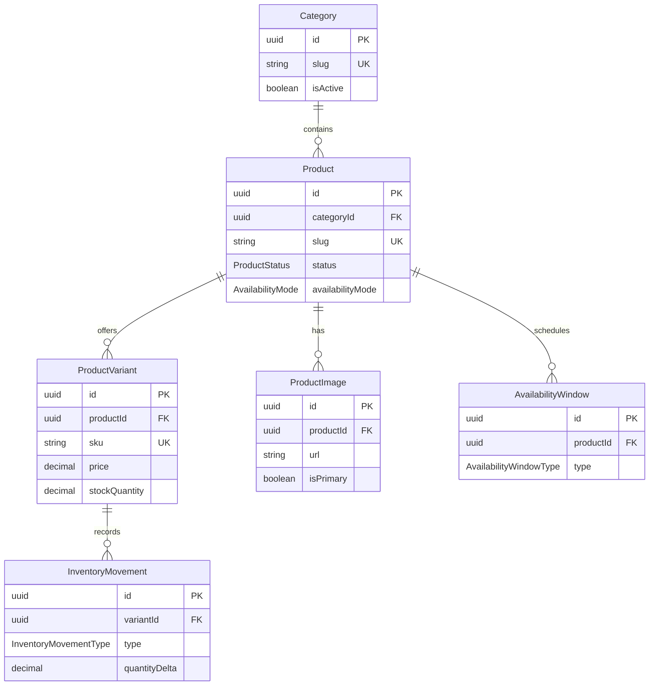

# Domen kataloga

## Poslovni cilj

Katalog Borske Farmice mora da podrži sir, kozje mleko, surutku, rakiju, jaja, stajsko đubrivo, sezonsko voće, sezonsko povrće i buduće kategorije koje administrator dodaje bez izmene koda. Sir, mleko i surutka ostaju glavni proizvodi i imaju poslovni prioritet u prezentaciji, ali model ne sme da bude vezan samo za mlečni asortiman.

U ovoj fazi definišemo strukturu podataka. CRUD API, storefront i admin panel nisu deo ove celine.

## Potvrđene kategorije

Za inicijalni seed potvrđene su samo sledeće kategorije, ovim redosledom:

1. Mlečni proizvodi
2. Voće
3. Povrće
4. Rakija
5. Jaja
6. Stajsko đubrivo

Proizvodi, varijante, cene, zalihe i fotografije se još ne seeduju.

## Ključne arhitektonske odluke

- `Category` predstavlja poslovnu grupu proizvoda i omogućava proširenje kataloga bez izmene koda.
- `Product` čuva zajednički sadržaj i merchandising podatke proizvoda.
- `ProductVariant` predstavlja konkretno pakovanje koje kupac bira i kupuje.
- Cena i SKU pripadaju varijanti, ne osnovnom proizvodu.
- Zaliha se vodi po varijanti; jedan proizvod može imati više varijanti.
- Slike i sezonska dostupnost primarno pripadaju proizvodu.
- Varijanta može biti nezavisno aktivna ili neaktivna.
- Proizvod se arhivira umesto fizičkog brisanja kada postoje povezani poslovni podaci.
- `InventoryMovement` je nepromenljiva istorija promena zalihe. Postojeći zapisi se ne ažuriraju niti brišu u redovnim poslovnim tokovima.
- Trenutna i rezervisana zaliha čuvaju se na varijanti radi brzog čitanja; dostupna količina se izvodi iz njih.
- Buduće porudžbine menjaju zalihe isključivo kroz transakcije koje zajedno ažuriraju varijantu i dodaju movement.
- Poslovna valuta je trenutno RSD. Cena se čuva kao precizan decimalni broj sa dve decimale.
- Količine i veličine pakovanja mogu imati do tri decimalna mesta.
- Pravilo jedne glavne slike po proizvodu obezbeđivaće servis transakcijom, jer Prisma schema ne izražava PostgreSQL partial unique indeks bez ručno održavanog SQL-a.

## Entiteti

### Category

**Odgovornost:** grupisanje proizvoda i upravljanje redosledom/vidljivošću kategorija.

**Ključna polja:** UUID, jedinstveni `name` i URL `slug`, opcioni opis i referenca slike, `isActive`, `sortOrder`, timestamps.

**Odnosi:** jedna kategorija ima više proizvoda.

**Lifecycle:** kreira se aktivna ili neaktivna, može da promeni sadržaj i redosled; kategorija sa proizvodima ne briše se rutinski.

**Ne čuva:** cenu, zalihu, sezonske periode ni sadržaj konkretnog proizvoda.

### Product

**Odgovornost:** zajednički naziv, opis, SEO, status i dostupnost proizvoda nezavisno od pakovanja.

**Ključna polja:** UUID, `categoryId`, jedinstveni `slug`, naziv, kratki i puni opis, `status`, `isFeatured`, `isMainProduct`, `availabilityMode`, `isManuallyAvailable`, opcioni SEO podaci, timestamps.

**Odnosi:** pripada jednoj kategoriji; ima više varijanti, slika i perioda dostupnosti.

**Lifecycle:** počinje kao `DRAFT`, objavljuje se kao `ACTIVE`, a povlači kao `ARCHIVED`. Arhiviranje je primarni način uklanjanja iz prodaje.

**Ne čuva:** cenu, SKU, stanje zalihe, veličinu pakovanja ni rezervisanu količinu.

### ProductVariant

**Odgovornost:** konkretno prodajno pakovanje, cena, merna jedinica i brzo stanje zalihe.

**Ključna polja:** UUID, `productId`, naziv, jedinstveni SKU, cena i opciona prethodna cena, količina pakovanja, jedinica mere, `stockQuantity`, `reservedQuantity`, low-stock prag, minimalna kupovina, korak kupovine, backorder/default/active flagovi, redosled i timestamps.

**Odnosi:** pripada jednom proizvodu; ima više inventory movements.

**Lifecycle:** može nezavisno da se aktivira/deaktivira. Istorijska varijanta se ne briše ako je učestvovala u poslovnom događaju.

**Ne čuva:** zajednički opis proizvoda, kategoriju, slike ili sezonske periode.

### ProductImage

**Odgovornost:** referenca fotografije proizvoda, pristupačan alt tekst i redosled prikaza.

**Ključna polja:** UUID, `productId`, URL, opcioni storage key/public ID, alt tekst, `isPrimary`, `sortOrder`, timestamps.

**Odnosi:** pripada jednom proizvodu.

**Lifecycle:** prati lifecycle proizvoda i može se zameniti ili ukloniti. Najviše jedna slika po proizvodu označava se kao glavna kroz transakcioni servisni invariant.

**Ne čuva:** binarni sadržaj slike, storage kredencijale, cenu ili podatke varijante.

### AvailabilityWindow

**Odgovornost:** opis jednog aktivnog ili neaktivnog perioda sezonske dostupnosti.

**Ključna polja:** UUID, `productId`, tip perioda, opcioni fiksni datumi ili month/day parovi, `isActive`, opciona javna poruka, `sortOrder`, timestamps.

**Odnosi:** pripada jednom proizvodu; proizvod može imati više perioda.

**Lifecycle:** period se može aktivirati/deaktivirati i menjati dok nije deo istorijskog snapshot-a. Kasniji servis validira polja prema tipu perioda.

**Ne čuva:** globalni status proizvoda, ručni availability flag, zalihu ili cenu.

### InventoryMovement

**Odgovornost:** nepromenljivi audit zapis jedne promene fizičke zalihe.

**Ključna polja:** UUID, `variantId`, tip promene, signed `quantityDelta`, opcioni resulting-stock snapshot, razlog, spoljašnja referenca i `createdAt`.

**Odnosi:** pripada jednoj varijanti.

**Lifecycle:** append-only. Korekcija se radi novim `ADJUSTMENT` zapisom, ne izmenom istorije.

**Ne čuva:** korisnika/actor foreign key dok autentifikacioni domen ne postoji, rezervaciju porudžbine kao zaseban domen, cenu ili podatke proizvoda.

## Relacije

## Jedinice mere

Enum vrednosti u kodu su na engleskom:

| Enum         | Prikaz/namena |
| ------------ | ------------- |
| `PIECE`      | komad         |
| `GRAM`       | gram          |
| `KILOGRAM`   | kilogram      |
| `MILLILITER` | mililitar     |
| `LITER`      | litar         |
| `PACKAGE`    | pakovanje     |
| `BAG`        | vreća         |

## Status proizvoda

- `DRAFT` nije javno vidljiv.
- `ACTIVE` može biti javno vidljiv samo ako postoji aktivna varijanta i zadovoljeni su uslovi dostupnosti.
- `ARCHIVED` se ne prikazuje kupcima i ne koristi za novu prodaju.

Status sam po sebi nije dovoljan za prikaz: budući servis kombinuje status, aktivnu varijantu, availability mode/window i stanje/backorder pravila.

## Dostupnost

`AvailabilityMode` razlikuje:

- `ALWAYS` — proizvod nije sezonski ograničen;
- `SEASONAL` — dostupnost zavisi od jednog ili više aktivnih perioda;
- `MANUAL` — koristi se `isManuallyAvailable` ručna kontrola.

`AvailabilityWindowType` razlikuje:

- `RECURRING_ANNUAL` — month/day početak i kraj, uključujući period preko kraja godine;
- `FIXED_DATE_RANGE` — konkretan `startsAt`/`endsAt` datumski period.

Proizvod može imati više perioda. Period može biti aktivan/neaktivan i imati javnu poruku, na primer „Dostupno u avgustu“. Nullable polja omogućavaju oba oblika, dok kasniji servis mora validirati tačno dozvoljene kombinacije. U ovoj fazi se ne implementira servis za računanje dostupnosti.

## Zalihe

- `stockQuantity` je trenutno fizičko stanje varijante.
- `reservedQuantity` je deo stanja rezervisan za nezavršene porudžbine.
- Dostupno stanje računa se kao `stockQuantity - reservedQuantity` i ne duplira se u bazi.
- `lowStockThreshold` određuje prag upozorenja.
- `minimumPurchaseQuantity` određuje najmanju kupovinu.
- `purchaseIncrement` određuje dozvoljeni korak povećanja količine.
- `allowBackorder` kontroliše buduću prodaju iznad dostupnog stanja; ne dozvoljava negativno fizičko stanje u samom modelu.
- Svaka promena fizičkog stanja dobija odgovarajući `InventoryMovement`.

Planirani tipovi promene:

- `INITIAL`
- `RESTOCK`
- `SALE`
- `ORDER_CANCELLATION`
- `RETURN`
- `ADJUSTMENT`
- `DAMAGE`

Promena zalihe i movement zapis kasnije moraju nastati u istoj transakciji.

## Brisanje i integritet

- Kategorija sa proizvodima ne briše se lako; relacija koristi restriktivno brisanje.
- Proizvod se prvenstveno arhivira.
- Varijante sa poslovnom istorijom ostaju sačuvane i deaktiviraju se.
- Slike i availability periodi mogu pratiti lifecycle proizvoda i biti uklonjeni sa proizvodom samo pre nastanka zavisnih poslovnih podataka.
- Inventory movement istorija ne sme nestati slučajnim cascade brisanjem.
- Buduće porudžbine čuvaće snapshot naziva proizvoda/varijante, SKU-a, količine i cene kako kasnije izmene kataloga ne bi promenile istoriju.

## Constraints i servisna pravila

Baza obezbeđuje nenegativne cene i stanja, pozitivne veličine/minimume/korake, nenulti movement delta, validne month/day opsege i nenegativan redosled. `compareAtPrice`, kada postoji, mora biti veća od cene. `reservedQuantity` ne može biti veća od `stockQuantity`; backorder utiče na prodajnu odluku, ne na integritet fizičkog i rezervisanog stanja.

Kombinacije nullable availability polja i pravilo jedne glavne slike po proizvodu proveravaće servis u transakciji. Precizna validacija kalendarskih datuma, uključujući februar, ostaje servisno pravilo kako DB constraint ne bi postao krhak.

## Još nepotvrđene odluke

Još nisu potvrđeni:

- tačna pakovanja;
- cene;
- početne zalihe;
- minimalne količine kupovine;
- konkretni periodi sezonske dostupnosti;
- fotografije;
- opisi proizvoda;
- online plaćanje;
- način dostave.

Zbog toga se u ovoj fazi ne seeduju proizvodi niti bilo koji izmišljeni poslovni podaci.
